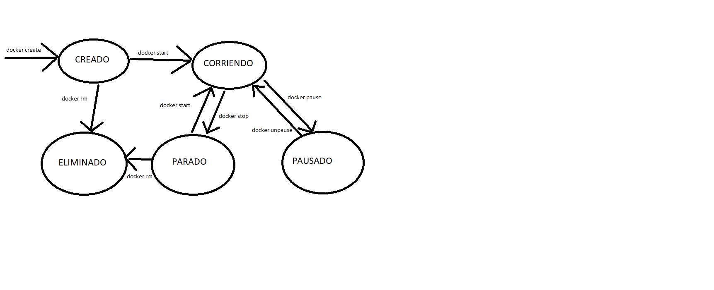
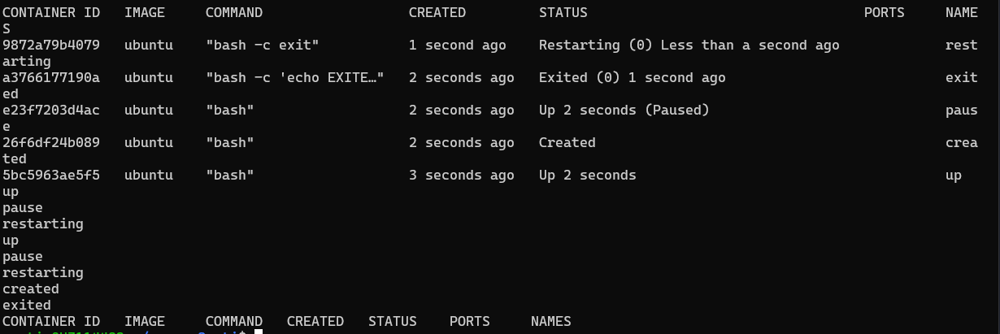

# EV2 DESPLIEGUE

## Martin Fagoaga

### __Ciclo de vida de un contenedor__



Un contenedor tiene los estados que vemos en la imagen. Para pasar de uno a otro, habría que ejecutar el comando que vemos junto a la flecha especificando el nombre o el id del contenedor. Por ejemplo, un contenedor llamado *app_laravel* se arrancaria así:

```bash
docker start app_laravel
```

### __Estados de los contenedores__

Con el siguiente script de bash creamos cinco contenedores con diferentes estados y los visualizamos. Finalmente se detienen y borran los contenedores:

```bash
#!/bin/bash

docker run -d -it --name up ubuntu 
docker create -it --name created ubuntu
docker run -d -it --name pause ubuntu
docker pause pause
docker run -d -it --name exited ubuntu bash -c 'echo EXITED;'
docker run -d -it --restart always --name restarting ubuntu bash -c exit
clear
sleep 1
docker ps -a
docker stop up pause restarting
docker rm up pause restarting created exited
docker ps -a
```

La salida de la ejecución de este script:




